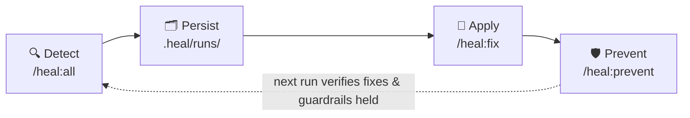

# The Heal Suite

### A repo that _audits, fixes, and hardens_ itself.

A self-maintaining repo immune system for [Claude Code](https://code.claude.com). The LLM-level complement to deterministic gates like linters and CI.

**[🔍 &nbsp;Explore the suite →](https://durchnull.github.io/heal-suite/)** &nbsp;&nbsp;·&nbsp;&nbsp; **[📊 &nbsp;Sample run dashboard →](https://durchnull.github.io/heal-suite/demo-run.html)** _(fictional project, real cost data)_

Every codebase drifts: docs go stale, deps age, invariants erode, the same bug class
returns — and usually a human notices, eventually. The Heal Suite makes drift
**detectable, persistent, fixable, and preventable**: 14 specialist auditors, each
owning one health axis (`/heal:arch`, `/heal:security`, `/heal:db`, `/heal:docs`, …),
plus 6 meta commands — an orchestrator, a fixer, a preventer, a report renderer, a
run lister, and an installer. Run it on a loop and the codebase converges toward
green instead of quietly rotting.

## Status: preview

The suite runs in production on two private repos and is being hardened through
regular runs on them. Extraction into an installable Claude Code plugin is in
progress — **nothing here is installable yet.** Watch/star to follow the release.

Questions, or something you'd want from v1?
[Open an issue](https://github.com/durchnull/heal-suite/issues) — feedback at this
stage directly shapes what ships first.

## The loop: detect → persist → apply → prevent

- **Detect** — `/heal:all` fans the healers out in parallel and fuses their reports
  into one health dashboard. Report-only by default; `--fix` hands only low-risk
  mechanical items to the fixer.
- **Persist** — every run hits disk with fingerprinted findings: runs diff into
  new / fixed / persisting trends, and open items converge to a durable backlog
  instead of being re-reported forever.
- **Apply** — `/heal:fix` drives the backlog to green: mechanical items land as
  focused, reviewable PRs — never silent edits; judgment items surface as explicit
  questions.
- **Prevent** — `/heal:prevent` promotes recurring findings into durable guardrails
  (rules, hooks, scripts, tests) — the hard reasoning happens once, then stays cheap
  to re-verify.

## Principles

- **Detection never mutates; mutation never audits.** Auditors only report —
  fixes only land through `/heal:fix`, never as a side effect of a scan.
- **Publishable numbers, not vibes.** Every run logs its provenance (model,
  commit, suite version) against frozen metric definitions, so published
  precision numbers are defensible.

## Roadmap to v1

The current phase is **depth through use**: the suite sweeps two private production
codebases on a regular rhythm — its home repo and a second project it installed
itself into via `/heal:init`. Every run feeds back: new checks distilled from real
findings, sharper fingerprints, fewer false positives, guardrails that graduate into
code — and all of it carries over to any project the suite is installed into.

- [x] Suite running in production (dogfooding on its home repo since June 2026)
- [x] Run logging, provenance, frozen metrics, precision tracking
- [x] `/heal:init` — the suite installed itself into a second real project
- [ ] **Depth through use** — keep running both codebases, fold what the runs teach back into the healers
- [ ] **Overnight runs** — a scheduled, unattended sweep: full audit, low-risk fixes landed as reviewable PRs, and a morning report of what needs attention
- [ ] Package as a Claude Code plugin (`/heal:*` namespace)
- [ ] Marketplace submission

## License

Not yet licensed — the plugin ships under an open license with the first installable
release. Until then, all rights reserved.
